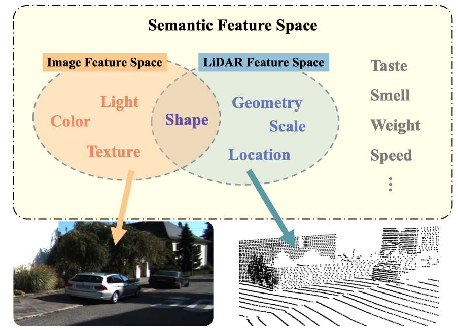
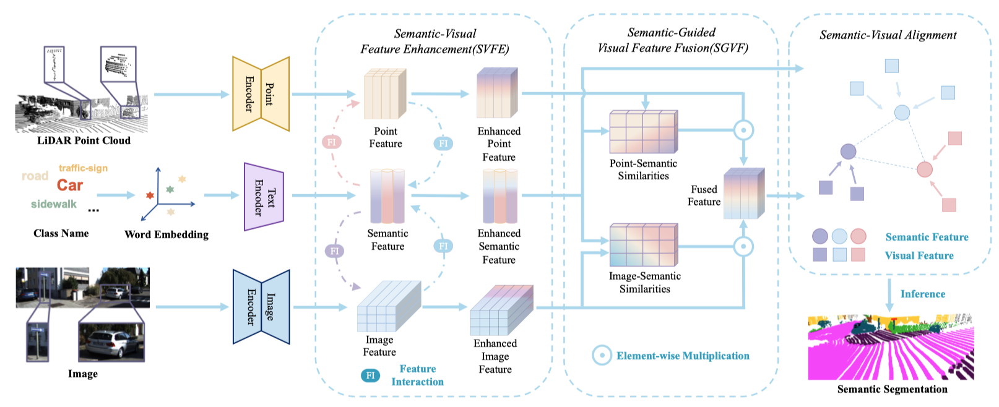

# See More and Know More: Zero-shot Point Cloud Segmentation via Multi-modal Visual Data

<p align="center">

</p>

## Abstract

Zero-shot point cloud segmentation aims to make deep models capable of recognizing novel objects in point cloud that are unseen in the training phase. Recent trends favor the pipeline which transfers knowledge from seen classes with labels to unseen classes without labels. They typically align visual features with semantic features obtained from word embedding by the supervision of seen classes’ annotations. However, point cloud contains limited information to fully match with semantic features. In fact, the rich appearance information of images is a natural complement to the textureless point cloud, which is not well explored in previous literature. Motivated by this, we propose a novel multi-modal zero-shot learning method to better utilize the complementary information of point clouds and images for more accurate visual-semantic alignment. 

## Pipeline

<p align="center">

</p>

  <tr>
  <td align="center">
    <em>Our approach enhances semantic-visual feature alignment by employing mutual enhancement of semantic and visual features, along with semantically-guided multimodal visual features fusion, leading to improved zero-shot performance..</em>
  </td>
  </tr>

</table>

## Next Step

Stay informed, the code will soon be released.

## BibTeX

If this work is helpful for your research, please consider citing:

```
@InProceedings{Lu_2023_ICCV,
    author    = {Lu, Yuhang and Jiang, Qi and Chen, Runnan and Hou, Yuenan and Zhu, Xinge and Ma, Yuexin},
    title     = {See More and Know More: Zero-shot Point Cloud Segmentation via Multi-modal Visual Data},
    booktitle = {Proceedings of the IEEE/CVF International Conference on Computer Vision (ICCV)},
    month     = {October},
    year      = {2023},
    pages     = {21674-21684}
}
```

